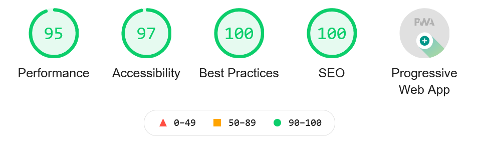

<p align="center">
  <a href="https://www.gatsbyjs.com">
  </a>
    
</p>
<p align="center">
  <a href="https://www.shopify.com">
  </a>
    
</p>

<p align="center">
  <a href="https://gatsbyshopify.netlify.app/">
 Visit: https://gatsbyshopify.netlify.app
  </a>
</p>


## 🚀 Quick start


 **Start server.**

    Navigate into your new site’s directory and start it up.
    
    ```shell
    cd ./
    gatsby develop
    ```

**Open the source code and start editing!**

    Your site is now running at `http://localhost:8000`!

    _Note: You'll also see a second link: _`http://localhost:8000/___graphql`_. This is a tool you can use to experiment with querying your data. 

<p align="center">
  <a href="https://www.gatsbyjs.com">
  </a>
    
</p>

***I am using free domain. Use custom/premium domain to increase performance score!***
